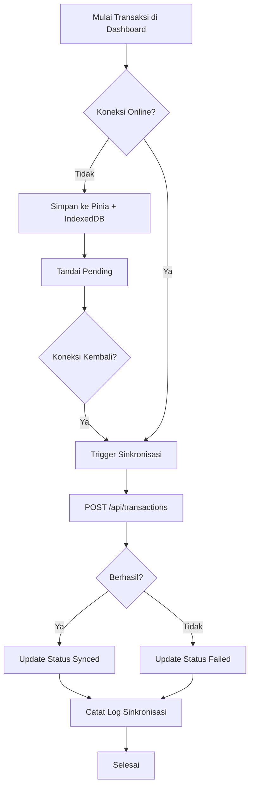

# Cashier Offline-First Platform

Proyek ini menyediakan contoh arsitektur kasir offline/online berbasis **Vue 3 + TypeScript** pada sisi frontend dan **Laravel 12** pada sisi backend. Antarmuka menggunakan **Tailwind CSS 4** dengan komponen **shadcn-vue**, serta mendukung penyimpanan transaksi secara lokal ketika perangkat tidak terhubung ke internet.

## Struktur Proyek

```
.
├── backend/            # Layanan RESTful Laravel 12
├── frontend/           # Aplikasi kasir offline-first berbasis Vue 3
├── docs/               # Dokumentasi tambahan (alur & flowchart)
└── readme.md           # Berkas dokumentasi utama
```

## Fitur Utama

- **Transaksi offline-first** dengan antrean lokal berbasis IndexedDB.
- **Sinkronisasi otomatis** ketika koneksi internet kembali tersedia.
- **Antarmuka shadcn-vue** yang di-styling menggunakan Tailwind CSS 4 (versi alpha).
- **Integrasi Laravel 12** sebagai backend API dengan endpoint `transactions` dan health check.
- **Pengelolaan state** menggunakan Pinia + Persisted State untuk menjaga transaksi lokal.
- **Service worker PWA** untuk caching aset dasar dan memastikan aplikasi tetap dapat diakses saat offline.

## Prasyarat

- Node.js 18+
- pnpm / npm / yarn
- PHP 8.2+
- Composer 2+
- SQLite (opsional) atau database lain yang dikonfigurasi di `.env`

## Menjalankan Frontend

```bash
cd frontend
pnpm install
pnpm dev
```

Buat file `.env` berdasarkan `.env.example` jika ingin mengubah endpoint API.

## Menjalankan Backend

```bash
cd backend
composer install
cp .env.example .env
php artisan key:generate
php artisan migrate
php artisan serve
```

Secara default backend menggunakan SQLite (`database/database.sqlite`). Pastikan file tersebut tersedia atau ganti konfigurasi database sesuai kebutuhan.

## Arsitektur Sinkronisasi

1. **Input Transaksi** – Pengguna mengisi data transaksi dari dashboard kasir.
2. **Antrean Lokal** – Data disimpan ke Pinia dan IndexedDB melalui `useTransactionQueue`.
3. **Service Worker** – Menjaga aset penting tetap tersedia saat offline.
4. **Deteksi Koneksi** – `@vueuse/core` memantau status jaringan dan memicu sinkronisasi saat online.
5. **API Laravel** – Endpoint `POST /api/transactions` menerima payload transaksi dan menyimpannya pada database.
6. **Log & Monitoring** – Pengguna dapat melihat log sinkronisasi dan status koneksi di halaman `Pusat Sinkronisasi`.

## Flowchart Alur Kerja



## Dokumentasi Tambahan

- [Detail Alur & Modul](docs/flow.md)

## Lisensi

Proyek ini dapat digunakan sebagai referensi atau titik awal pengembangan sistem kasir offline/online.
